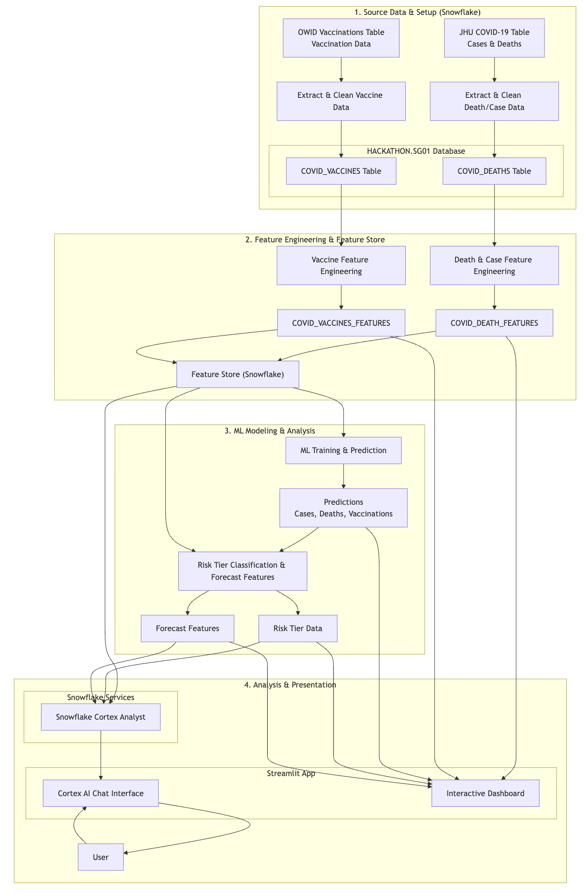

# COVID-19 Public Health Intelligence Platform

This project builds an end-to-end COVID analytics stack on Snowflake and serves it through a Streamlit dashboard with a Cortex Analyst assistant.

Track: Social Good Prompt 01: Public health trend intelligence — ML forecasting + Cortex AI
## Demo

- Demo link: [https://drive.google.com/file/d/1Og7r8xABc4YTlVWIR-jsoA_ZEP6sKkMy/view?usp=sharing](#)

## Tech Stack

- Data platform: Snowflake
- Data source: Starschema COVID-19 Epidemiological Data share
- SQL pipeline: Snowflake SQL in `scripts.sql`
- ML: `SNOWFLAKE.ML.FORECAST` in `ML.ipynb`
- App framework: Streamlit
- Visualization: Plotly + Streamlit native components
- Conversational analytics: Snowflake Cortex Analyst via semantic view `HACKATHON.SG01.FIRST`

## Open Source Packages Used

- `streamlit`: Builds the interactive dashboard UI and app layout.
- `plotly`: Powers interactive forecast and trend visualizations.
- `pandas`: Handles tabular transformations before rendering tables/charts.
- `snowflake-snowpark-python`: Connects Python app code to Snowflake data and SQL execution.

## Architecture Diagram



## UI Preview

|  |  |
|---|---|
|  |  |
|  |  |


## 1) Data Procurement and Curation

Data is sourced from the Snowflake shared dataset:

- Source database: `COVID19_EPIDEMIOLOGICAL_DATA`
- Source schema: `PUBLIC`
- Source tables:
  - `JHU_COVID_19` (cases and deaths)
  - `OWID_VACCINATIONS` (vaccination metrics)

Using the SQL in `scripts.sql`, the pipeline:

- Filters to country-level records (`PROVINCE_STATE IS NULL`)
- Computes coverage quality and keeps countries with sufficiently abundant history
- Builds curated base tables for deaths/cases and vaccinations
- Applies feature engineering to create model-ready time-series features

Countries are retained only when they have enough date coverage and non-null signal across cases, deaths, and vaccinations.

## 2) Core Feature Engineering

Important engineered features include:

- `ROLLING_7DAY_CASES`, `ROLLING_7DAY_DEATHS`
- `CFR_PCT` (case fatality rate)
- `WOW_GROWTH_PCT` (week-over-week growth)
- `DOUBLING_TIME_DAYS`
- `IS_WAVE_PERIOD`, `CASES_14D_AGO`, `IS_LOCAL_PEAK`
- `CASES_PER_100K`, `DEATHS_PER_100K`, `RISK_SCORE`
- Vaccination features: `NEW_VACCINATIONS`, `VAX_COVERAGE_14D_LAG`
- Calendar signals: `MONTH_NUM`, `DAY_OF_WEEK`, `WEEK_OF_YEAR`

## 3) ML Notebook (`ML.ipynb`)

`ML.ipynb` trains Snowflake time-series models per country for 3 targets:

- `ROLLING_7DAY_CASES`
- `ROLLING_7DAY_DEATHS`
- `NEW_VACCINATIONS`

The notebook uses `SNOWFLAKE.ML.FORECAST`, with one series per `COUNTRY_REGION`, then evaluates model quality through Snowflake evaluation metrics.

We track SMAPE for forecast quality because unlike MAPE, SMAPE is robust when true values are near zero, avoiding divide-by-zero instability.

## 4) Final Analytical and Forecast Tables

The pipeline produces and serves these key outputs:

1. `COVID_DEATH_FEATURES` (death/case feature table)
2. `COVID_VACCINES_FEATURES`
3. `COUNTRY_RISK_TIERS` (risk tier classification)
4. `FORECAST_ROLLING_7DAY_CASES` (7-day cases forecast)
5. `FORECAST_ROLLING_7DAY_DEATHS` (7-day deaths forecast)
6. `COVID_VACCINATIONS_FORECAST_RESULTS` (30-day new vaccinations forecast with lower/upper bounds)

## 5) Cortex Analyst + Dashboard

A semantic view is attached for Cortex Analyst (`HACKATHON.SG01.FIRST`), and the Streamlit app serves:

- Interactive country-level dashboards (overview, forecasts, reports)
- A Cortex Analyst agent that acts as a support agent for analytical Q&A. It does more than summarize countries and reports.

## Fairness Note

The dashboard includes a **Data Quality** tab that explicitly surfaces potential data issues and bias signals.
It shows country-level data gaps (missing days, null percentages, expected vs. actual coverage) and bias indicators
from `HACKATHON.SG01.DATA_QUALITY_REPORT` and `HACKATHON.SG01.BIAS_FLAGS`.

## Run the App

```bash
streamlit run streamlit_app.py
```
